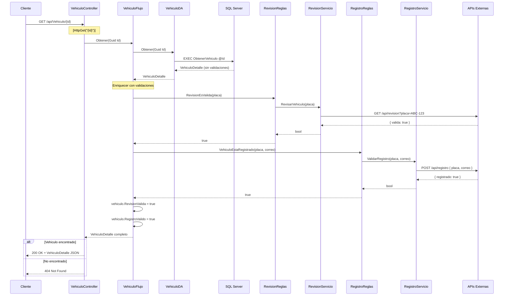

# API - GET: Detalle de Vehículo

## 📘 Operación de Lectura por ID (Read One)

Este documento explica la implementación del endpoint para **obtener el detalle de un vehículo específico** con validaciones externas.

---

## 🎯 Objetivo

Obtener información completa de un vehículo específico, incluyendo validaciones de revisión técnica y registro vehicular.

**Endpoint**: `GET /api/Vehiculo/{id}`

**Response**: `VehiculoDetalle` (datos completos + validaciones)

---

## 🔄 Flujo Completo con Validaciones Externas



---

## 💻 Implementación Backend

### 1. Controller

```csharp
// API/Controllers/VehiculoController.cs

/// <summary>
/// Obtiene el detalle completo de un vehículo específico.
/// Incluye validaciones externas (revisión técnica y registro).
/// </summary>
/// <param name="Id">GUID del vehículo</param>
/// <returns>Detalle del vehículo con validaciones</returns>
/// <response code="200">Retorna el detalle del vehículo</response>
/// <response code="404">El vehículo no existe</response>
[HttpGet("{Id}")]
[ProducesResponseType(typeof(VehiculoDetalle), StatusCodes.Status200OK)]
[ProducesResponseType(StatusCodes.Status404NotFound)]
public async Task<IActionResult> Obtener([FromRoute] Guid Id)
{
    try
    {
        _logger.LogInformation($"Obteniendo vehículo con ID: {Id}");
        
        // 1. Validar que el ID sea válido
        if (Id == Guid.Empty)
        {
            _logger.LogWarning("ID inválido proporcionado");
            return BadRequest(new { mensaje = "ID de vehículo inválido" });
        }
        
        // 2. Obtener vehículo con validaciones
        var resultado = await _vehiculoFlujo.Obtener(Id);
        
        // 3. Validar si existe
        if (resultado == null)
        {
            _logger.LogWarning($"Vehículo con ID {Id} no encontrado");
            return NotFound(new { mensaje = "Vehículo no encontrado" });
        }
        
        // 4. Retornar con 200 OK
        _logger.LogInformation($"Vehículo {resultado.Placa} encontrado");
        return Ok(resultado);
    }
    catch (Exception ex)
    {
        _logger.LogError(ex, $"Error al obtener vehículo {Id}");
        return StatusCode(500, new { mensaje = "Error interno del servidor" });
    }
}
```

**Nuevos elementos vs GET all**:
- ✅ `[FromRoute]`: Extrae ID de la URL
- ✅ Validación de Guid.Empty
- ✅ Manejo de 404 Not Found
- ✅ Logging específico con ID

---

### 2. Flujo con Validaciones

```csharp
// Flujo/VehiculoFlujo.cs

/// <summary>
/// Obtiene un vehículo por ID y lo enriquece con validaciones externas.
/// </summary>
/// <param name="Id">GUID del vehículo</param>
/// <returns>Vehículo con RevisionValida y RegistroValido</returns>
public async Task<VehiculoDetalle> Obtener(Guid Id)
{
    // 1. Obtener datos base de la BD
    var vehiculo = await _vehiculoDA.Obtener(Id);
    
    if (vehiculo == null)
    {
        return null; // Controller manejará el 404
    }
    
    // 2. ⭐ Enriquecer con validación de revisión técnica
    try
    {
        vehiculo.RevisionValida = await _revisionReglas.RevisionEsValida(vehiculo.Placa);
    }
    catch (Exception ex)
    {
        // Si falla API externa, asumir false
        vehiculo.RevisionValida = false;
        // Log warning pero no fallar toda la operación
    }
    
    // 3. ⭐ Enriquecer con validación de registro
    try
    {
        vehiculo.RegistroValido = await _registroReglas.VehiculoEstaRegistrado(
            vehiculo.Placa, 
            vehiculo.CorreoPropietario
        );
    }
    catch (Exception ex)
    {
        // Si falla API externa, asumir false
        vehiculo.RegistroValido = false;
    }
    
    // 4. Retornar vehículo enriquecido
    return vehiculo;
}
```

**Patrón aplicado**: **Enriquecimiento progresivo**
- Primero obtener datos base ✅
- Luego agregar validaciones ✅
- Si las validaciones fallan, no romper toda la operación ✅

---

### 3. Reglas de Negocio

```csharp
// Reglas/RevisionReglas.cs
public class RevisionReglas : IRevisionReglas
{
    private readonly IRevisionServicio _revisionServicio;

    public RevisionReglas(IRevisionServicio revisionServicio)
    {
        _revisionServicio = revisionServicio;
    }

    /// <summary>
    /// Verifica si un vehículo tiene revisión técnica vigente.
    /// </summary>
    /// <param name="placa">Placa del vehículo</param>
    /// <returns>True si la revisión está vigente</returns>
    public async Task<bool> RevisionEsValida(string placa)
    {
        // Delegar a servicio externo
        return await _revisionServicio.RevisarVehiculo(placa);
    }
}

// Reglas/RegistroReglas.cs
public class RegistroReglas : IRegistroReglas
{
    private readonly IRegistroServicio _registroServicio;

    public RegistroReglas(IRegistroServicio registroServicio)
    {
        _registroServicio = registroServicio;
    }

    /// <summary>
    /// Verifica si un vehículo está correctamente registrado.
    /// </summary>
    /// <param name="placa">Placa del vehículo</param>
    /// <param name="correo">Correo del propietario</param>
    /// <returns>True si está registrado</returns>
    public async Task<bool> VehiculoEstaRegistrado(string placa, string correo)
    {
        // Delegar a servicio externo
        return await _registroServicio.ValidarRegistro(placa, correo);
    }
}
```

**SRP**: Reglas solo contienen lógica de validación, delegan comunicación a Servicios.

---

### 4. Servicios (External APIs)

```csharp
// Servicios/RevisionServicio.cs
public class RevisionServicio : IRevisionServicio
{
    private readonly IHttpClientFactory _httpClientFactory;
    private readonly IConfiguracion _configuracion;
    private readonly ILogger<RevisionServicio> _logger;

    public RevisionServicio(
        IHttpClientFactory httpClientFactory, 
        IConfiguracion configuracion,
        ILogger<RevisionServicio> logger)
    {
        _httpClientFactory = httpClientFactory;
        _configuracion = configuracion;
        _logger = logger;
    }

    public async Task<bool> RevisarVehiculo(string placa)
    {
        try
        {
            string endpoint = _configuracion.ObtenerMetodo("Revision", "RevisarVehiculo");
            var cliente = _httpClientFactory.CreateClient();
            cliente.Timeout = TimeSpan.FromSeconds(5); // Timeout corto
            
            var solicitud = new HttpRequestMessage(HttpMethod.Get, $"{endpoint}?placa={placa}");
            var respuesta = await cliente.SendAsync(solicitud);
            
            if (!respuesta.IsSuccessStatusCode)
            {
                _logger.LogWarning($"API de revisión retornó {respuesta.StatusCode}");
                return false; // Default seguro
            }
            
            var contenido = await respuesta.Content.ReadAsStringAsync();
            var resultado = JsonSerializer.Deserialize<RevisionResponse>(contenido, new JsonSerializerOptions
            {
                PropertyNameCaseInsensitive = true
            });
            
            return resultado?.Valida ?? false;
        }
        catch (TaskCanceledException ex)
        {
            _logger.LogWarning(ex, $"Timeout al verificar revisión de {placa}");
            return false;
        }
        catch (Exception ex)
        {
            _logger.LogError(ex, $"Error al verificar revisión de {placa}");
            return false;
        }
    }
}
```

**Patrones de resiliencia**:
- ✅ Timeout corto (5 segundos)
- ✅ Try-catch con logging
- ✅ Default seguro (false) si falla
- ✅ No romper toda la operación

---

## 📊 Modelos

### VehiculoDetalle (extiende VehiculoResponse)

```csharp
// Abstracciones/Modelos/Vehiculo.cs

/// <summary>
/// DTO para vista de detalle de vehículo.
/// Incluye todos los campos de VehiculoResponse + validaciones externas.
/// </summary>
public class VehiculoDetalle : VehiculoResponse
{
    /// <summary>
    /// Indica si la revisión técnica está vigente.
    /// Validado contra API externa.
    /// </summary>
    public bool RevisionValida { get; set; }
    
    /// <summary>
    /// Indica si el registro vehicular es válido.
    /// Validado contra API externa.
    /// </summary>
    public bool RegistroValido { get; set; }
}
```

**Herencia**: VehiculoDetalle IS-A VehiculoResponse + validaciones extras.

---

## 🔐 HTTP Response Examples

### Caso 1: Vehículo encontrado (200 OK)

```http
HTTP/1.1 200 OK
Content-Type: application/json; charset=utf-8

{
  "id": "3fa85f64-5717-4562-b3fc-2c963f66afa6",
  "placa": "ABC-123",
  "color": "Rojo",
  "anio": 2023,
  "precio": 25000.00,
  "marca": "Toyota",
  "modelo": "Corolla",
  "correoPropietario": "juan@example.com",
  "telefonoPropietario": "555-1234",
  "idModelo": "8fa85f64-5717-4562-b3fc-2c963f66afa6",
  "revisionValida": true,
  "registroValido": true
}
```

### Caso 2: Vehículo no encontrado (404 Not Found)

```http
HTTP/1.1 404 Not Found
Content-Type: application/json; charset=utf-8

{
  "mensaje": "Vehículo no encontrado"
}
```

### Caso 3: ID inválido (400 Bad Request)

```http
HTTP/1.1 400 Bad Request
Content-Type: application/json; charset=utf-8

{
  "mensaje": "ID de vehículo inválido"
}
```

---

## ⚡ Performance y Resiliencia

### Challenge: Llamadas Externas Lentas

**Problema**: APIs externas pueden tardar segundos o fallar.

**Solución implementada**:

```csharp
// 1. Timeout corto
cliente.Timeout = TimeSpan.FromSeconds(5);

// 2. Try-catch por cada validación
try
{
    vehiculo.RevisionValida = await ...;
}
catch (Exception ex)
{
    vehiculo.RevisionValida = false; // Default
}

// 3. Logging sin romper
_logger.LogWarning(ex, "Fallo validación pero continuamos");

// 4. No propagar excepción al cliente
```

### Mejora Futura: Circuit Breaker

```csharp
// Con Polly library
var policy = Policy
    .Handle<HttpRequestException>()
    .CircuitBreakerAsync(
        handledEventsAllowedBeforeBreaking: 3,
        durationOfBreak: TimeSpan.FromMinutes(1)
    );

await policy.ExecuteAsync(async () => 
{
    return await _revisionServicio.RevisarVehiculo(placa);
});
```

**Patrón**: Si 3 requests fallan, abrir circuito por 1 minuto (no intentar más).

---

## 🎯 Diferencias con GET All

| Aspecto | **GET All** | **GET by ID** |
|---------|-------------|---------------|
| **Endpoint** | `/api/Vehiculo` | `/api/Vehiculo/{id}` |
| **Response** | `VehiculoResponse[]` | `VehiculoDetalle` |
| **Validaciones** | ❌ No | ✅ Sí (RevisionValida, RegistroValido) |
| **API Calls Externos** | 0 | 2 por vehículo |
| **Performance** | Fast (~100ms) | Slow (~2-5 segundos) |
| **Status Codes** | 200, 204 | 200, 404, 400 |
| **Use Case** | Listar todos | Ver detalle uno |

**Razón**: Validaciones solo donde son necesarias (no en listados).

---

## 🧪 Testing

```csharp
[Fact]
public async Task ObtenerPorId_VehiculoExiste_Retorna200ConValidaciones()
{
    // Arrange
    var id = Guid.NewGuid();
    var vehiculo = new VehiculoDetalle 
    { 
        Id = id, 
        Placa = "ABC-123",
        RevisionValida = true,
        RegistroValido = true
    };
    _mockFlujo.Setup(f => f.Obtener(id)).ReturnsAsync(vehiculo);

    // Act
    var result = await _controller.Obtener(id);

    // Assert
    var okResult = Assert.IsType<OkObjectResult>(result);
    var data = Assert.IsType<VehiculoDetalle>(okResult.Value);
    Assert.True(data.RevisionValida);
    Assert.True(data.RegistroValido);
}

[Fact]
public async Task ObtenerPorId_VehiculoNoExiste_Retorna404()
{
    // Arrange
    var id = Guid.NewGuid();
    _mockFlujo.Setup(f => f.Obtener(id)).ReturnsAsync((VehiculoDetalle)null);

    // Act
    var result = await _controller.Obtener(id);

    // Assert
    Assert.IsType<NotFoundObjectResult>(result);
}

[Fact]
public async Task ObtenerPorId_IdVacio_Retorna400()
{
    // Arrange & Act
    var result = await _controller.Obtener(Guid.Empty);

    // Assert
    Assert.IsType<BadRequestObjectResult>(result);
}
```

---

## 📚 Documentos Relacionados

- **[API - GET Listar](./01-api-get-listar-vehiculos.md)** - Listar todos sin validaciones
- **[API - POST Crear](./03-api-post-crear-vehiculo.md)** - Crear nuevo vehículo
- **[API - PUT Editar](./04-api-put-editar-vehiculo.md)** - Actualizar vehículo

---

**Siguiente**: [03 - POST Crear Vehículo](./03-api-post-crear-vehiculo.md)
