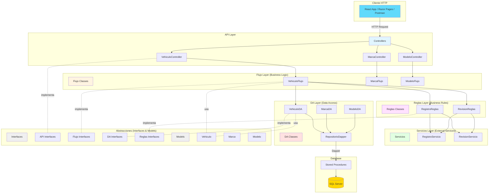
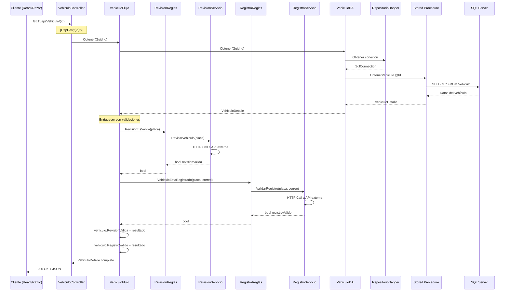

# Arquitectura del API ASP.NET Core - Vehiculo.API

## 📘 Guía Educativa Completa

Este documento explica la arquitectura completa del backend **Vehiculo.API**, desarrollado con **ASP.NET Core** siguiendo los principios de **Clean Architecture** y **SOLID**.

---

## 🎯 ¿Qué es Vehiculo.API?

**Vehiculo.API** es un Web API RESTful construido con ASP.NET Core que proporciona endpoints para gestionar vehículos, marcas y modelos. Sirve como backend para aplicaciones cliente (React, Razor Pages, móvil, etc.).

### Características Principales

- ✅ **RESTful**: Sigue convenciones REST (GET, POST, PUT, DELETE)
- ✅ **Arquitectura en Capas**: Separación clara de responsabilidades
- ✅ **SOLID Principles**: Código mantenible y escalable
- ✅ **Dapper**: ORM ligero para acceso a datos
- ✅ **Dependency Injection**: Gestión automática de dependencias
- ✅ **Stored Procedures**: Lógica de BD encapsulada
- ✅ **CORS**: Configurado para aplicaciones cliente

---

## 🏗️ Arquitectura General del Proyecto



---

## 📁 Estructura de Carpetas

```
Vehiculo.API/
├── Abstracciones/              # Contratos e interfaces
│   ├── Interfaces/
│   │   ├── API/               # Interfaces de controladores
│   │   │   ├── IMarcaController.cs
│   │   │   ├── IModeloController.cs
│   │   │   └── IVehiculoController.cs
│   │   ├── DA/                # Interfaces de acceso a datos
│   │   │   ├── IMarcaDA.cs
│   │   │   ├── IModeloDA.cs
│   │   │   ├── IVehiculoDA.cs
│   │   │   └── IRepositorioDapper.cs
│   │   ├── Flujo/             # Interfaces de lógica de negocio
│   │   │   ├── IMarcaFlujo.cs
│   │   │   ├── IModeloFlujo.cs
│   │   │   └── IVehiculoFlujo.cs
│   │   ├── Reglas/            # Interfaces de reglas de negocio
│   │   │   ├── IConfiguracion.cs
│   │   │   ├── IRegistroReglas.cs
│   │   │   └── IRevisionReglas.cs
│   │   └── Servicios/         # Interfaces de servicios externos
│   └── Modelos/               # DTOs y modelos de datos
│       ├── Marca.cs
│       ├── Modelo.cs
│       └── Vehiculo.cs
│
├── API/                        # Capa de presentación
│   ├── Controllers/
│   │   ├── MarcaController.cs
│   │   ├── ModeloController.cs
│   │   └── VehiculoController.cs
│   ├── Program.cs             # Configuración y DI
│   └── appsettings.json       # Configuración
│
├── Flujo/                      # Lógica de negocio
│   ├── MarcaFlujo.cs
│   ├── ModeloFlujo.cs
│   └── VehiculoFlujo.cs
│
├── Reglas/                     # Reglas de negocio
│   ├── Configuracion.cs
│   ├── RegistroReglas.cs
│   └── RevisionReglas.cs
│
├── Servicios/                  # Servicios externos
│   ├── RegistroServicio.cs
│   └── RevisionServicio.cs
│
├── DA/                         # Acceso a datos
│   ├── MarcaDA.cs
│   ├── ModeloDA.cs
│   ├── VehiculoDA.cs
│   └── Repositorios/
│       └── RepositorioDapper.cs
│
└── BD/                         # Base de datos (proyecto SQL)
    └── dbo/
        └── Stored Procedures/
```

---

## 🔄 Flujo de una Request Completa

### Ejemplo: GET /api/Vehiculo/{id}



---

## 📊 Capas de la Arquitectura

### 1. Abstracciones (Contratos)

Contiene **interfaces** y **modelos** compartidos por todas las capas.

#### Interfaces

**Principio aplicado**: **Dependency Inversion Principle (DIP)**

```csharp
// Abstracciones/Interfaces/Flujo/IVehiculoFlujo.cs
public interface IVehiculoFlujo
{
    Task<Guid> Agregar(VehiculoRequest vehiculo);
    Task<Guid> Editar(Guid Id, VehiculoRequest vehiculo);
    Task<Guid> Eliminar(Guid Id);
    Task<IEnumerable<VehiculoResponse>> Obtener();
    Task<VehiculoDetalle> Obtener(Guid Id);
}
```

**Ventaja**: Las capas superiores dependen de abstracciones, no de implementaciones concretas.

#### Modelos (DTOs)

**Principio aplicado**: **Interface Segregation Principle (ISP)**

```csharp
// Abstracciones/Modelos/Vehiculo.cs

// Para crear o actualizar (Request)
public class VehiculoRequest
{
    public Guid IdModelo { get; set; }
    public string Placa { get; set; }
    public string Color { get; set; }
    public int Anio { get; set; }
    public decimal Precio { get; set; }
    public string CorreoPropietario { get; set; }
    public string TelefonoPropietario { get; set; }
}

// Para listar (Response - datos básicos)
public class VehiculoResponse
{
    public Guid Id { get; set; }
    public string Placa { get; set; }
    public string Color { get; set; }
    public int Anio { get; set; }
    public decimal Precio { get; set; }
    public string Marca { get; set; }
    public string Modelo { get; set; }
    public string CorreoPropietario { get; set; }
    public string TelefonoPropietario { get; set; }
}

// Para detalle (Detalle - datos completos + validaciones)
public class VehiculoDetalle : VehiculoResponse
{
    public bool RegistroValido { get; set; }
    public bool RevisionValida { get; set; }
}
```

**Separación de modelos según contexto**:
- `VehiculoRequest`: Solo para input (POST/PUT)
- `VehiculoResponse`: Datos básicos para listados
- `VehiculoDetalle`: Datos enriquecidos para vista individual

### 2. API Layer (Controllers)

**Responsabilidad**: Recibir requests HTTP, validar entrada básica, delegar a la capa de negocio, devolver responses HTTP.

**Principio aplicado**: **Single Responsibility Principle (SRP)**

```csharp
// API/Controllers/VehiculoController.cs
[Route("api/[controller]")]
[ApiController]
public class VehiculoController : ControllerBase, IVehiculoController
{
    private IVehiculoFlujo _vehiculoFlujo;
    private ILogger<VehiculoController> _logger;

    public VehiculoController(IVehiculoFlujo vehiculoFlujo, ILogger<VehiculoController> logger)
    {
        _vehiculoFlujo = vehiculoFlujo;
        _logger = logger;
    }

    // POST /api/Vehiculo
    [HttpPost]
    public async Task<IActionResult> Agregar([FromBody] VehiculoRequest vehiculo)
    {
        var resultado = await _vehiculoFlujo.Agregar(vehiculo);
        return CreatedAtAction(nameof(Obtener), new { Id = resultado }, null);
    }

    // PUT /api/Vehiculo/{Id}
    [HttpPut("{Id}")]
    public async Task<IActionResult> Editar([FromRoute] Guid Id, [FromBody] VehiculoRequest vehiculo)
    {
        if (!await VerificarVehiculoExiste(Id))
            return NotFound("El vehículo no existe");
            
        var resultado = await _vehiculoFlujo.Editar(Id, vehiculo);
        return Ok(resultado);
    }

    // DELETE /api/Vehiculo/{Id}
    [HttpDelete("{Id}")]
    public async Task<IActionResult> Eliminar([FromRoute] Guid Id)
    {
        if (!await VerificarVehiculoExiste(Id))
            return NotFound("El vehículo no existe");
            
        var resultado = await _vehiculoFlujo.Eliminar(Id);
        return NoContent(); // 204
    }

    // GET /api/Vehiculo
    [HttpGet]
    public async Task<IActionResult> Obtener()
    {
        var resultado = await _vehiculoFlujo.Obtener();
        if (!resultado.Any())
            return NoContent(); // 204
            
        return Ok(resultado); // 200
    }

    // GET /api/Vehiculo/{Id}
    [HttpGet("{Id}")]
    public async Task<IActionResult> Obtener([FromRoute] Guid Id)
    {
        var resultado = await _vehiculoFlujo.Obtener(Id);
        return Ok(resultado); // 200
    }

    // Helper privado
    private async Task<bool> VerificarVehiculoExiste(Guid Id)
    {
        var resultado = await _vehiculoFlujo.Obtener(Id);
        return resultado != null;
    }
}
```

**Características**:
- ✅ Atributos de routing: `[HttpGet]`, `[HttpPost]`, etc.
- ✅ Binding de parámetros: `[FromRoute]`, `[FromBody]`
- ✅ Status codes apropiados: 200 OK, 201 Created, 204 No Content, 404 Not Found
- ✅ Dependency Injection del flujo
- ✅ Logging disponible

### 3. Flujo Layer (Business Logic)

**Responsabilidad**: Orquestar la lógica de negocio, coordinar entre DA y Reglas.

**Principio aplicado**: **Single Responsibility + Open/Closed**

```csharp
// Flujo/VehiculoFlujo.cs
public class VehiculoFlujo : IVehiculoFlujo
{
    private IVehiculoDA _vehiculoDA;
    private IRegistroReglas _registroReglas;
    private IRevisionReglas _revisionReglas;

    public VehiculoFlujo(
        IVehiculoDA vehiculoDA, 
        IRevisionReglas revisionReglas, 
        IRegistroReglas registroReglas)
    {
        _vehiculoDA = vehiculoDA;
        _revisionReglas = revisionReglas;
        _registroReglas = registroReglas;
    }

    // Operaciones simples: delegan directo a DA
    public async Task<Guid> Agregar(VehiculoRequest vehiculo)
    {
        return await _vehiculoDA.Agregar(vehiculo);
    }

    public async Task<Guid> Editar(Guid Id, VehiculoRequest vehiculo)
    {
        return await _vehiculoDA.Editar(Id, vehiculo);
    }

    public async Task<Guid> Eliminar(Guid Id)
    {
        return await _vehiculoDA.Eliminar(Id);
    }

    public async Task<IEnumerable<VehiculoResponse>> Obtener()
    {
        return await _vehiculoDA.Obtener();
    }

    // Operación compleja: enriquece con reglas de negocio
    public async Task<VehiculoDetalle> Obtener(Guid Id)
    {
        // 1. Obtener datos base de DA
        var vehiculo = await _vehiculoDA.Obtener(Id);
        
        // 2. Aplicar reglas de negocio (validaciones externas)
        vehiculo.RevisionValida = await _revisionReglas.RevisionEsValida(vehiculo.Placa);
        vehiculo.RegistroValido = await _registroReglas.VehiculoEstaRegistrado(
            vehiculo.Placa, 
            vehiculo.CorreoPropietario
        );
        
        // 3. Retornar objeto enriquecido
        return vehiculo;
    }
}
```

**Patrón**: Flujo coordina entre capas, pero no tiene lógica de datos ni lógica HTTP.

### 4. Reglas Layer (Business Rules)

**Responsabilidad**: Encapsular reglas de negocio complejas, validaciones, lógica de dominio.

**Principio aplicado**: **Single Responsibility**

```csharp
// Reglas/RevisionReglas.cs
public class RevisionReglas : IRevisionReglas
{
    private IRevisionServicio _revisionServicio;

    public RevisionReglas(IRevisionServicio revisionServicio)
    {
        _revisionServicio = revisionServicio;
    }

    public async Task<bool> RevisionEsValida(string placa)
    {
        // Lógica de negocio: consultar servicio externo
        return await _revisionServicio.RevisarVehiculo(placa);
    }
}

// Reglas/RegistroReglas.cs
public class RegistroReglas : IRegistroReglas
{
    private IRegistroServicio _registroServicio;

    public RegistroReglas(IRegistroServicio registroServicio)
    {
        _registroServicio = registroServicio;
    }

    public async Task<bool> VehiculoEstaRegistrado(string placa, string correo)
    {
        // Lógica de negocio: validar contra servicio externo
        return await _registroServicio.ValidarRegistro(placa, correo);
    }
}
```

**Ventaja**: Si la lógica de validación cambia (ej: de API externa a BD), solo se cambia esta capa.

### 5. Servicios Layer (External Services)

**Responsabilidad**: Comunicación con servicios externos (APIs, microservicios).

```csharp
// Servicios/RevisionServicio.cs
public class RevisionServicio : IRevisionServicio
{
    private IHttpClientFactory _httpClientFactory;
    private IConfiguracion _configuracion;

    public RevisionServicio(IHttpClientFactory httpClientFactory, IConfiguracion configuracion)
    {
        _httpClientFactory = httpClientFactory;
        _configuracion = configuracion;
    }

    public async Task<bool> RevisarVehiculo(string placa)
    {
        try
        {
            string endpoint = _configuracion.ObtenerMetodo("Revision", "RevisarVehiculo");
            var cliente = _httpClientFactory.CreateClient();
            var solicitud = new HttpRequestMessage(HttpMethod.Get, $"{endpoint}?placa={placa}");
            
            var respuesta = await cliente.SendAsync(solicitud);
            respuesta.EnsureSuccessStatusCode();
            
            var resultado = await respuesta.Content.ReadAsStringAsync();
            return JsonSerializer.Deserialize<bool>(resultado);
        }
        catch (Exception)
        {
            // Log error
            return false; // Default si falla
        }
    }
}
```

**Patrón**: Servicios encapsulan llamadas HTTP, parseo JSON, manejo de errores.

### 6. DA Layer (Data Access)

**Responsabilidad**: Acceso a base de datos, ejecución de stored procedures, mapeo de datos.

**Principio aplicado**: **Single Responsibility + Dependency Inversion**

```csharp
// DA/VehiculoDA.cs
public class VehiculoDA : IVehiculoDA
{
    private IRepositorioDapper _repositorioDapper;
    private SqlConnection _sqlConnection;

    public VehiculoDA(IRepositorioDapper repositorioDapper)
    {
        _repositorioDapper = repositorioDapper;
        _sqlConnection = _repositorioDapper.ObtenerRepositorio();
    }

    public async Task<Guid> Agregar(VehiculoRequest vehiculo)
    {
        string query = @"AgregarVehiculo"; // Nombre del SP
        
        var resultado = await _sqlConnection.ExecuteScalarAsync<Guid>(query, new
        {
            Id = Guid.NewGuid(),
            IdModelo = vehiculo.IdModelo,
            Placa = vehiculo.Placa,
            Color = vehiculo.Color,
            Anio = vehiculo.Anio,
            Precio = vehiculo.Precio,
            CorreoPropietario = vehiculo.CorreoPropietario,
            TelefonoPropietario = vehiculo.TelefonoPropietario
        });
        
        return resultado;
    }

    public async Task<Guid> Editar(Guid Id, VehiculoRequest vehiculo)
    {
        await VerificarVehiculoExiste(Id);
        
        string query = @"EditarVehiculo";
        
        var resultado = await _sqlConnection.ExecuteScalarAsync<Guid>(query, new
        {
            Id = Id,
            IdModelo = vehiculo.IdModelo,
            Placa = vehiculo.Placa,
            Color = vehiculo.Color,
            Anio = vehiculo.Anio,
            Precio = vehiculo.Precio,
            CorreoPropietario = vehiculo.CorreoPropietario,
            TelefonoPropietario = vehiculo.TelefonoPropietario
        });
        
        return resultado;
    }

    public async Task<Guid> Eliminar(Guid Id)
    {
        await VerificarVehiculoExiste(Id);
        
        string query = @"EliminarVehiculo";
        
        var resultado = await _sqlConnection.ExecuteScalarAsync<Guid>(query, new { Id = Id });
        return resultado;
    }

    public async Task<IEnumerable<VehiculoResponse>> Obtener()
    {
        string query = @"ObtenerVehiculos";
        
        var resultado = await _sqlConnection.QueryAsync<VehiculoResponse>(query);
        return resultado;
    }

    public async Task<VehiculoDetalle> Obtener(Guid Id)
    {
        string query = @"ObtenerVehiculo";
        
        var resultado = await _sqlConnection.QueryAsync<VehiculoDetalle>(query, new { Id = Id });
        return resultado.FirstOrDefault();
    }

    // Helper privado
    private async Task VerificarVehiculoExiste(Guid Id)
    {
        var vehiculo = await Obtener(Id);
        if (vehiculo == null)
            throw new Exception("No se encontró el vehículo");
    }
}
```

**Dapper** se usa en lugar de Entity Framework por:
- ✅ Performance superior
- ✅ Control total sobre queries
- ✅ Stored Procedures nativos
- ✅ Mapeo simple

#### Repositorio Dapper

```csharp
// DA/Repositorios/RepositorioDapper.cs
public class RepositorioDapper : IRepositorioDapper
{
    private IConfiguracion _configuracion;

    public RepositorioDapper(IConfiguracion configuracion)
    {
        _configuracion = configuracion;
    }

    public SqlConnection ObtenerRepositorio()
    {
        string connectionString = _configuracion.ObtenerMetodo("ConnectionStrings", "VehiculoDB");
        var conexion = new SqlConnection(connectionString);
        return conexion;
    }
}
```

**Responsabilidad**: Proveer conexión a BD centralizada.

---

## ⚙️ Dependency Injection (DI)

La configuración de servicios se hace en `Program.cs`:

```csharp
// API/Program.cs
var builder = WebApplication.CreateBuilder(args);

// Registrar servicios en el contenedor de DI
builder.Services.AddControllers();
builder.Services.AddSwaggerGen();
builder.Services.AddHttpClient();

// Registrar implementaciones con sus interfaces
builder.Services.AddScoped<IVehiculoFlujo, VehiculoFlujo>();
builder.Services.AddScoped<IMarcaFlujo, MarcaFlujo>();
builder.Services.AddScoped<IModeloFlujo, ModeloFlujo>();

builder.Services.AddScoped<IVehiculoDA, VehiculoDA>();
builder.Services.AddScoped<IMarcaDA, MarcaDA>();
builder.Services.AddScoped<IModeloDA, ModeloDA>();

builder.Services.AddScoped<IRepositorioDapper, RepositorioDapper>();

builder.Services.AddScoped<IRegistroServicio, RegistroServicio>();
builder.Services.AddScoped<IRevisionServicio, RevisionServicio>();

builder.Services.AddScoped<IRegistroReglas, RegistroReglas>();
builder.Services.AddScoped<IRevisionReglas, RevisionReglas>();

builder.Services.AddScoped<IConfiguracion, Configuracion>();

// Configurar CORS
var politicaAcceso = "Politica de acceso";
builder.Services.AddCors(options =>
{
    options.AddPolicy(name: politicaAcceso,
        policy =>
        {
            policy.WithOrigins("https://localhost", "https://localhost:50427", "https://localhost:50428")
                  .AllowAnyHeader()
                  .AllowAnyMethod();
        });
});

var app = builder.Build();

// Middleware pipeline
if (app.Environment.IsDevelopment())
{
    app.UseSwagger();
    app.UseSwaggerUI();
}

app.UseHttpsRedirection();
app.UseCors(politicaAcceso);
app.UseAuthorization();
app.MapControllers();

app.Run();
```

**Ventajas de DI**:
- ✅ Bajo acoplamiento
- ✅ Testeable (fácil crear mocks)
- ✅ Gestión automática de lifecycle
- ✅ Thread-safe

---

## 📊 Endpoints REST

### Vehículos

| Método | Endpoint | Body | Response | Descripción |
|--------|----------|------|----------|-------------|
| POST | `/api/Vehiculo` | `VehiculoRequest` | 201 + Location | Crear vehículo |
| PUT | `/api/Vehiculo/{id}` | `VehiculoRequest` | 200 OK | Actualizar vehículo |
| DELETE | `/api/Vehiculo/{id}` | - | 204 No Content | Eliminar vehículo |
| GET | `/api/Vehiculo` | - | 200 + `VehiculoResponse[]` | Listar todos |
| GET | `/api/Vehiculo/{id}` | - | 200 + `VehiculoDetalle` | Obtener detalle |

### Marcas

| Método | Endpoint | Response | Descripción |
|--------|----------|----------|-------------|
| GET | `/api/Marca` | `Marca[]` | Listar marcas |
| GET | `/api/Marca/{id}` | `Marca` | Obtener marca |
| GET | `/api/Marca/{id}/modelos` | `Modelo[]` | Modelos de marca |

### Modelos

| Método | Endpoint | Response | Descripción |
|--------|----------|----------|-------------|
| GET | `/api/Modelo` | `Modelo[]` | Listar modelos |
| GET | `/api/Modelo/{id}` | `Modelo` | Obtener modelo |

---

## 🔐 CORS (Cross-Origin Resource Sharing)

Configurado para permitir requests desde aplicaciones cliente:

```csharp
builder.Services.AddCors(options =>
{
    options.AddPolicy(name: politicaAcceso,
        policy =>
        {
            policy.WithOrigins(
                    "https://localhost",           // React dev server
                    "https://localhost:50427",     // Razor Pages
                    "https://localhost:50428"      // Otro puerto
                )
                .AllowAnyHeader()                   // Cualquier header
                .AllowAnyMethod();                  // GET, POST, PUT, DELETE
        });
});
```

---

## 🎯 Principios SOLID Aplicados

### 1. Single Responsibility Principle (SRP)

Cada clase tiene una única responsabilidad:

```
✅ VehiculoController → Solo maneja HTTP requests/responses
✅ VehiculoFlujo → Solo orquesta lógica de negocio
✅ VehiculoDA → Solo accede a datos
✅ RepositorioDapper → Solo provee conexión
```

### 2. Open/Closed Principle (OCP)

Abierto a extensión, cerrado a modificación:

```csharp
// Se puede agregar nueva implementación sin modificar código existente
public interface IVehiculoDA { ... }

// Implementación actual: Dapper + SQL Server
public class VehiculoDA : IVehiculoDA { ... }

// Implementación futura: Entity Framework
public class VehiculoEFDA : IVehiculoDA { ... }

// Implementación futura: MongoDB
public class VehiculoMongoDA : IVehiculoDA { ... }
```

### 3. Liskov Substitution Principle (LSP)

Las implementaciones son intercambiables:

```csharp
// Cualquier implementación de IVehiculoDA funciona
IVehiculoDA vehiculoDA = new VehiculoDA(repo);
// o
IVehiculoDA vehiculoDA = new VehiculoEFDA(context);
```

### 4. Interface Segregation Principle (ISP)

Interfaces específicas y pequeñas:

```csharp
// ✅ Interfaces segregadas por responsabilidad
public interface IVehiculoDA
{
    Task<Guid> Agregar(VehiculoRequest vehiculo);
    Task<Guid> Editar(Guid Id, VehiculoRequest vehiculo);
    // ...
}

public interface IMarcaDA
{
    Task<IEnumerable<Marca>> Obtener();
    // ...
}

// ❌ NO hacer: interfaz gigante con todo
// public interface IDataAccess { /* 50 métodos */ }
```

### 5. Dependency Inversion Principle (DIP)

Depender de abstracciones, no de concreciones:

```csharp
// ✅ Correcto: depende de interfaz
public class VehiculoFlujo : IVehiculoFlujo
{
    private IVehiculoDA _vehiculoDA;  // Abstracción
    
    public VehiculoFlujo(IVehiculoDA vehiculoDA)
    {
        _vehiculoDA = vehiculoDA;
    }
}

// ❌ Incorrecto: depende de implementación concreta
// private VehiculoDA _vehiculoDA = new VehiculoDA();
```

---

## 🔄 Comparación con React (Frontend)

| Aspecto | **Vehiculo.API (Backend)** | **React (Frontend)** |
|---------|---------------------------|----------------------|
| **Lenguaje** | C# | JavaScript/TypeScript |
| **Framework** | ASP.NET Core | React |
| **Arquitectura** | Capas (Controller → Flujo → DA) | Capas (Presentation → Application → Data → Domain) |
| **Routing** | Atributos `[HttpGet]`, `[Route]` | React Router DOM |
| **DI** | Built-in ASP.NET Core | Manual (new instances en hooks) |
| **Data Access** | Dapper + SQL Server | Fetch API + HTTP |
| **State** | Stateless (cada request independiente) | Stateful (useState, Context) |
| **Response** | JSON serializado | JSX renderizado |
| **Validation** | Data Annotations, ModelState | HTML5 + Custom |
| **Testing** | xUnit, NUnit | Jest, React Testing Library |

**Complementariedad**:
- Frontend (React) → Hace requests HTTP
- Backend (API) → Procesa requests, accede a datos, retorna JSON
- Desacoplamiento total: pueden desarrollarse independientemente

---

## 🚀 Ventajas de esta Arquitectura

### 1. Separación de Responsabilidades
- Cada capa tiene su función específica
- Fácil de entender y mantener

### 2. Testeable
- Cada capa se puede testear independientemente
- Mocks fáciles con interfaces

### 3. Escalable
- Agregar nuevas entidades sigue el mismo patrón
- Fácil agregar nuevos servicios/reglas

### 4. Flexible
- Cambiar implementación de DA (de Dapper a EF) sin afectar otras capas
- Agregar caché sin modificar controllers

### 5. Reutilizable
- Mismo API para React, Razor Pages, móvil, etc.
- Lógica de negocio centralizada

---

## 📝 Mejoras Potenciales

1. **Manejo de Errores Global**: Middleware para capturar excepciones
2. **Logging Estructurado**: Serilog o Application Insights
3. **Validación Robusta**: FluentValidation
4. **Autenticación/Autorización**: JWT, OAuth
5. **Caché**: Redis o MemoryCache
6. **Rate Limiting**: Prevenir abuso
7. **Health Checks**: Monitorear estado del API
8. **Versionado**: `/api/v1/Vehiculo`, `/api/v2/Vehiculo`
9. **Paginación**: Para listados grandes
10. **Documentación**: Comentarios XML para Swagger

---

## 📚 Referencias

- [ASP.NET Core Documentation](https://learn.microsoft.com/en-us/aspnet/core/)
- [Dapper](https://github.com/DapperLib/Dapper)
- [Clean Architecture](https://blog.cleancoder.com/uncle-bob/2012/08/13/the-clean-architecture.html)
- [SOLID Principles in C#](https://www.c-sharpcorner.com/UploadFile/damubetha/solid-principles-in-C-Sharp/)

---

**Siguiente**: [Documentación de Vehiculos.WEB (Razor Pages)](./vehiculos-web-arquitectura.md)
